

# Practical Activity 2:

*Inheritance, Overriding, Polymorphism, Abstract classes and interfaces*.

`Realized By:  Abdelkebir Bouchti`

`Content`

***

|`Exercise 01`|
|-------------|

[1.1 Class diagram](#page3)

[1.2 Class Person](#page4)

[1.3 Class Adherent](#page5)

[1.4 Class Auteur](#page6)

[1.5 Class Livre](#page7)

[1.6 Application](#page8)

[1.7 Results](#page9)

***

|`Exercise 02`|
|-------------|

[2.1 Class diagram](#page10)

[2.2 Class Employe](#page11) 

[2.3 Class Ingenieur](#page12) 

[2.4 Class Manager](#page13)

[2.5 Main](#page15)

[2.6 Results](#page16)

***

|`Exercise 03`|
|-------------|

[3.1 Class diagram](#page17)

[3.2 Class Ordinateur](#page18)

[3.3 Class Categorie](#page19)

[3.4 Class Commande](#page20)

[3.5 Class LigneCommande](#page21)

[3.6 Client](#page22)

[3.7 Main](#page23)

[3.8 Results](#page24)

***

|`Exercise 04`|
|-------------|

[4.1 Class diagram](#page25)

[4.2 Class Produit](#page26)

[4.3 Class IMetierProduit](#page27)

[4.4 Class MetierProduitImpl](#page28)

[4.5 Class Application](#page29)

[4.6 Results and cases](#page30)

***

|**Summary** |
|-----------|

---

Exercise 1 :

In This exercise we want to build and application JAVA, in order to manage the books and members of the library.

The purpose here is to practice inheritance!

1. Class diagram

Figure 1 – Show the class diagram of the exercise.

2. Person Class

`Tasks:` 

- Create the class person with private attributes, nom, prenom , email , tel , age .
- Add constructor to initialize different attributes.
- Made a method afficher() for returning the information’s about attributes.

public class Personne {

`    `private String nom, prenom, email;

`    `private long age;

`    `private String tel;

`    `public Personne(String nom,String prenom,String email,long age, String tel)

`    `{

`        `this.nom = nom;

`        `this.prenom = prenom;

`        `this.email = email;

`        `this.tel = tel;

`        `this.age = age;

`    `}

`    `public void afficher()

`    `{

`        `System.*out*.println("Name : " + this.nom);

`        `System.*out*.println("Prenom : " + this.prenom);         System.*out*.println("Email : " + this.email);         System.*out*.println("Tel : " + this.tel);

`        `System.*out*.println("Age : " + this.age);

`    `} }

3. Adherent Class
+Tasks:
- Create the class Adherent who inherent from Person class.
- Create Attribute numAdherent
- Create the method afficher() for showing the informations. 

  public class Adherent extends Personne{

  `    `public int numAdherent ;![ref1]

  `    `public Adherent(String nom,String prenom,String email,long age, String tel, int numAdherent)

  `    `{

  `        `super(nom,prenom,email,age,tel);

  `        `this.numAdherent = numAdherent;

  `    `}

  `    `public void afficher()

  `    `{

  `        `super.afficher();

  `        `System.*out*.println("This is NumAdherent : " + numAdherent);

  `    `}

  }

4.  Auteur Class
`Tasks:`
- Create a numAuteur attribute.
- Create a Constructor for inserting the inputs to the superclass.
- Create a method for showing the information about the author.

  public class Auteur extends Personne{

    public int numAuteur ;

    public Auteur(String nom,String prenom,String email,long age, String tel,int numAuteur)
    {
        super(nom,prenom,email,age,tel);
        this.numAuteur = numAuteur;
    }

    public void afficher()
    {
        super.afficher();
        System.out.println("This is number of Autor : " + numAuteur);
    }

}

5. Livre Class

   Tasks: 

- Create Livre class with attributes ISBN and auteur.
- Create the method show for showing the information’s about the attributes.

public class Livre {

`    `private long ISBN;

`    `private String titre;     private Auteur aut;

`    `public Livre(Auteur new\_aut, String titre, long ISBN)     {

`        `this.aut = new\_aut;

`        `this.ISBN = ISBN ;

`        `this.titre = titre;

`    `}

`    `public void afficher()

`    `{

`        `aut.afficher();

`        `System.*out*.println("This is ISBN :" + ISBN + " \nthis is title : " + titre);

`    `}

}

6. Application

public class Main {

`    `public static void main(String[] args) {

`        `// Create an instance of Adherent

`        `Adherent adherent = new Adherent("Bouchti", "Abdelkebir", "abdo@gmail.com", 23, "065432191", 101);

`        `// Create an instance of Auteur

`        `Auteur auteur = new Auteur("Badaoui", "Houda", "houda@gmail.com", 45, "067834578", 202);

`        `// Create an instance of Livre with the Auteur instance         Livre livre = new Livre(auteur, "Boite à Merveilles", 9781234567890L);

`        `// Display information about the Adherent

`        `System.*out*.println("Informations sur l'adhérent:");         adherent.afficher();

`        `System.*out*.println("\nInformations sur le livre:");         // Display information about the Livre and its Auteur         livre.afficher();

`    `}

}

7. Resultat :

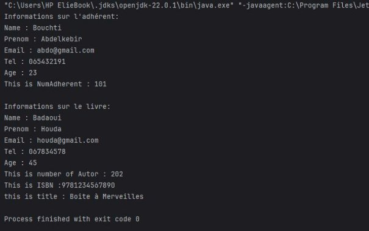

---

`Exercise 2:` 

The purpose of this exercise is to create an application JAVA for managing the salary of engineer and managers inside a corporate of web development utilizing the inheritance and abstract classes.

1. Class Diagram 

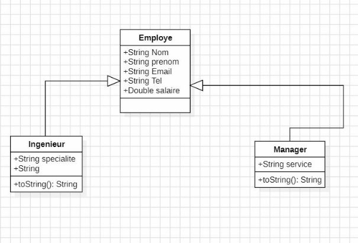

Figure 2: Class diagram of the exercise.

2. Employe Class.
`Tasks : `
- Create an abstract class with attributes, nom ,prenom ,email , tel , salaire.
- Add constructor for initialize the attributes.
- Add abstract method for returning the salary , this method is implemented by the other class.

public abstract class Employe {

`    `private String nom , prenom , email ; private double salaire;

`    `private String tel;

`    `public Employe(String name,String prenom , String email,double salaire , String tel)

`    `{

`        `this.nom = name;

`        `this.prenom = prenom;

`        `this.email = email;

`        `this.salaire = salaire;

`        `this.tel = tel;

`    `}

`    `public abstract double calculerSalaire();

`    `public double getSalaire()

`    `{

`        `return this.salaire;

`    `}

`    `public void afficher()

`    `{

`        `System.*out*.println("Name : " + this.nom);

`        `System.*out*.println("Second Name : " + this.prenom);     }

}

3. Ingénieur Class. 
`Tasks :` 
- Create an ingenieur class with the special attribute.
- Redefine the method calculerSalaire().

\-

public class Ingenieur extends Employe {

`    `private String specialite;

`    `public Ingenieur(String name,String prenom , String email,double salaire , String tel, String spe)

`    `{

`        `super(name,prenom,email,salaire,tel);

`        `this.specialite = spe;

`    `}

`    `public double calculerSalaire()

`    `{

`        `return getSalaire()\*0.15;     }

`    `@Override

`    `public void afficher() {

`        `super.afficher();

`        `System.*out*.println("Salary  : "+this.getSalaire()\*1.15);

`        `System.*out*.println("Service : " + this.specialite);     }

}

4. Manager Class. 
`Tasks :`
- Create a class manager with service attribute.
- Redefine the method calculerSalaire().

public class Manager extends Employe { private String service;

`    `public Manager(String name,String prenom , String email,double salaire , String tel,String Service)

`    `{

`        `super(name,prenom,email,salaire,tel);

`        `this.service = Service;

`    `}

`    `public double calculerSalaire()

`    `{

`     `return getSalaire()\*0.20;

`    `}

`    `public void afficher() {

`        `super.afficher();

`        `System.*out*.println("Salary : " + this.getSalaire()\*1.20);

`        `System.*out*.println("Service : " + this.service);     }

}

5. Main.

public class Main {

`    `public static void main(String[] args) 

`    `{

`        `// Creating instances of Ingenieur and Manager

`        `Ingenieur ingenieur = new Ingenieur("John", "Doe", "john.doe@example.com", 5000, "123456789", "Software");

`        `Manager manager = new Manager("Jane", "Smith", "jane.smith@example.com", 6000, "987654321", "HR");

`        `// Displaying details and calculated salaries for both         System.*out*.println("Ingenieur Details:");

`        `ingenieur.afficher();

`        `System.*out*.println("Calculated Salary: " + ingenieur.calculerSalaire());

`        `System.*out*.println("\nManager Details:");         manager.afficher();

`        `System.*out*.println("Calculated Salary: " + manager.calculerSalaire());

`    `}

}

6. Results.

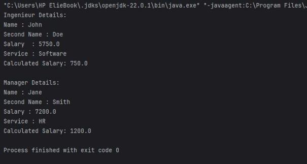

---

`Exercise 03: `

The purpose of this exercise is to create an application JAVA for managing the commands of clients for a corporate.

The application can manage the articles and the categories also the commands.

1.  Diagram Class
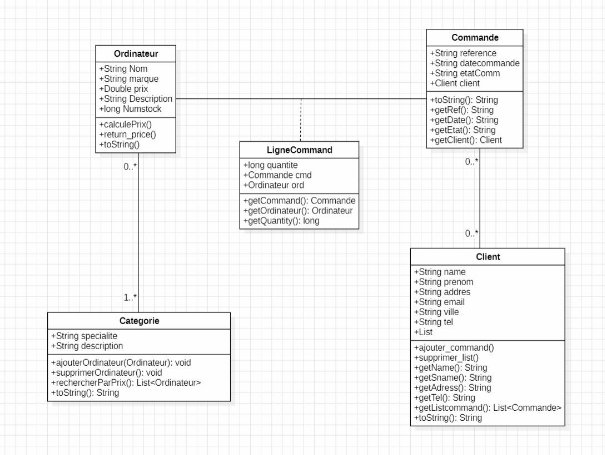

`Figure 3 : Diagram of class` 

2. Ordinateur Class. 
`Tasks :` 
- Create class ordinateur with attributes, nom , marque, prix , description , stock.
- Each laptop belongs to a category.
- Create a method for returning the final price of a laptop given.

  public class Ordinateur {

  `    `private String nom, marque, description;     private long stock;

  `    `private double prix;

  `    `//This is a instructor

  `    `public Ordinateur(String n , String m , String d, long s, double p)

  `    `{

  `        `this.nom = n;

  `        `this.marque = m;

  `        `this.description = d;

  `        `this.stock = s;

  `        `this.prix = p;

  `    `}

  `    `public double calcule\_prix(long quentite)     {

  `            `return prix\*quentite;

  `    `}

  `    `public double getPrix() {

  `        `return this.prix;

  `    `}

  `    `public String getName()

  `    `{

  `        `return this.nom;

  `    `}

  `    `public String getMarque()

  `    `{

  `        `return this.marque;

  `    `}

  `    `public String getDescription()

  `    `{

  `        `return this.description;

  `    `}

  `    `public String toString()

  `    `{

  `        `return "Name : " + nom + "\n" +

  `                `"Marque : " + marque + "\n" +

  `                `"Description : " + description + "\n" +                 "Price : " + prix;

  `    `}

  }

3. Category Class. 
`Tasks :` 
- Create a category class with these attributes, nom, description, list laptop.
- Create method ajouterOrdinateur() for adding the new laptops.
- Create method supprimerOrdinateur() for removing the laptops and also rechercherParPrix() for searching the price.

import java.util.ArrayList; 
import java.util.List;

public class Categorie {

`    `private String nom , desciption ;

`    `private List<Ordinateur> objects\_ordinateur;

`    `public Categorie(String n , String p)

`    `{

`        `this.nom = n;

`        `this.desciption = p;

`        `objects\_ordinateur = new ArrayList<Ordinateur>();     }

`    `public void ajouterOrdinateurs(Ordinateur ord)

`    `{

`        `if (!objects\_ordinateur.contains(ord))

`        `{

`            `objects\_ordinateur.add(ord);

`        `}

`        `else

`            `System.*out*.println("Already in the List !");     }

`    `public void supprimerOrdinateur(Ordinateur ord)

`    `{

`        `if (objects\_ordinateur.contains(ord))

`            `objects\_ordinateur.remove(ord);

`        `else

`            `System.*out*.println("This is not on the list !");     }

`    `public List<Ordinateur> rchercheParPrix(double price)     {

`        `List<Ordinateur> ord\_price = new ArrayList<Ordinateur>();

`        `for (Ordinateur o : objects\_ordinateur)

`        `{

`            `if (o.getPrix() == price)

`                `ord\_price.add(o);

`        `}

`        `if(ord\_price.isEmpty())

`        `{

`            `System.*out*.println("No Ordinator has this price !");

`            `return new ArrayList<>();

`        `}

`        `else

`            `return ord\_price;

`    `}

`    `public String toString()

`    `{

`        `return "Categorie : \n " +

`                `"Nom : " + nom + "\n"

+ " Description : " + desciption ;

`    `}

}

4. Commande Class.
`Tasks :` 
- Create a Commande class with these attributes, reference, date , etat\_command, client.
- Create methods for getting the infromations about the attributes. 

import java.util.random.RandomGenerator;

public class Commande {

`    `private String reference, date ,etat\_command;     private Client client;

`    `public Commande(String ref , Client c, String date\_commande, String etat )

`    `{

`        `this.reference = ref;

`        `this.client = c;

`        `this.date = date\_commande;         this.etat\_command = etat;     }

`    `public String getRef()

`    `{

`        `return this.reference;

`    `}

`    `public String getDate()

`    `{

`        `return this.date;

`    `}

`    `public String getEtat()

`    `{

`        `return this.etat\_command;     }

`    `public Client getClient()

`    `{

`        `return this.client;

`    `}

`    `public String toString()

`    `{

`        `return "Reference : " + reference + "\n" +

`                `"\nInformation about Client : " + client + "\n" +

`                `"DateCommande : " + date + "\n" +

`                `"Etat : " + etat\_command ;

`    `}

}

5. LigneCommand Class.
`Tasks :` 
- Create a LigneCommande class with these quantite, command, ordinateur.
- Create methods for getting the infromations about the attributes. 
- public class Lignecommande { )private long quntite;

  `    `private Commande cmd;

  `    `private Ordinateur ord;

`    `public Lignecommande(long q, Commande c , Ordinateur o)

`    `{

`        `this.quntite = q;

`        `this.cmd = c;

`        `this.ord = o;

`    `}

`    `public String ToString()

`    `{

`        `return "Quantite : " + quntite + "\n" +

`                `"Command : " + cmd + "\n" +

`                `"Ordinateur : " + ord + "\n";     }

`    `public Commande getCommand()

`    `{

`        `return this.cmd;

`    `}

`    `public Ordinateur getOrdinateur()     {

`        `return this.ord;

`    `}

`    `public long getQuantity()

`    `{

`        `return this.quntite;

`    `}

}

6. Client Class.
`Tasks : `
- Create a Client class with these nom, prenom , address, email , ville , tel , list\_command.
- Create method ajouter\_command() for adding a commands.
- Create method supprimer\_list() to remove a command from a list.
- Create methods for get access to the attributes.
- toString for showing the informations in the main.

import java.util.ArrayList;

import java.util.List;![ref3]

public class Client {

`    `private String nom, prenom,addres, email , ville,tel;     private List<Commande> list\_command;

`    `public Client(String n , String p , String a , String e , String v , String t)

`    `{

`        `this.nom = n;

`        `this.prenom = p;

`        `this.addres = a;

`        `this.email = e;

`        `this.ville = v;

`        `this.tel = t;

`        `this.list\_command = new ArrayList<Commande>();

`    `}

`    `public void Ajouter\_command(Commande cmd)

`    `{

`        `if(!list\_command.contains(cmd))

`            `list\_command.add(cmd);

`        `else

`            `System.*out*.println("Already in list !");     }

`    `public void Supprimer\_list(Commande cmd)

`    `{

`        `if(list\_command.contains(cmd))

`            `list\_command.remove(cmd);

`        `else

`            `System.*out*.println("Not in the List !");     }

`    `public String getName()

`    `{

`        `return this.nom;

`    `}

`    `public String getSname()     {

`        `return this.prenom;

`    `}

`    `public String getAddress()     {

`        `return this.addres;

`    `}

`    `public String getTel()

`    `{

`        `return this.tel;

`    `}

`    `public List<Commande> getListCommand()     {![ref1]

`        `return this.list\_command;

`    `}

`    `public String toString()

`    `{

`        `return " \nNom : " + nom + "\n" +

`                `"Prenom : " + prenom + "\n" +                 "Address : " + addres + "\n" +                 "Email : " + email + "\n" +

`                `"Ville : " + ville + "\n" +

`                `"Tel : " + tel ;

`    `}

}

7. Main.

import java.util.List;

public class Main {

`    `public static void main(String[] args) {

`        `// Creating a client

`        `Client client = new Client("John", "Doe", "123 Main St", "john.doe@example.com", "Paris", "0123456789");

`        `// Creating a category

`        `Categorie categorie = new Categorie("Laptops", "High- performance laptops");

`        `// Creating some computers

`        `Ordinateur laptop1 = new Ordinateur("XPS 13", "Dell", "High-end ultraportable", 10, 1200.00);

`        `Ordinateur laptop2 = new Ordinateur("MacBook Pro", "Apple", "Professional laptop", 5, 2500.00);

`        `Ordinateur laptop3 = new Ordinateur("ThinkPad X1", "Lenovo", "Business laptop", 8, 1800.00);

`        `// Adding computers to the category

`        `categorie.ajouterOrdinateurs(laptop1);         categorie.ajouterOrdinateurs(laptop2);

`        `categorie.ajouterOrdinateurs(laptop3);

`        `// Displaying category details         System.*out*.println(categorie);

`        `// Searching for a computer by price in the category

`        `System.*out*.println("\nSearching for laptops priced at 1800.00:");

`        `List<Ordinateur> foundOrdinateurs = categorie.rchercheParPrix(1800.00);

`        `for (Ordinateur ord : foundOrdinateurs) {

`            `System.*out*.println(ord);

`        `}

`        `// Creating a command for the client

`        `Commande commande = new Commande("CMD123", client, "2024-11-03", "Pending");

`        `client.Ajouter\_command(commande);

`        `// Creating a line command (order line) for the command

`        `Lignecommande ligneCommande = new Lignecommande(2, commande, laptop1);

`        `// Displaying order details

`        `System.*out*.println("\nOrder Details:");         System.*out*.println(commande);

`        `// Displaying line command details

`        `System.*out*.println("\nLine Command Details:");

`        `System.*out*.println(ligneCommande);

`        `// Calculating and displaying the price for the ordered quantity

`        `double totalCost = laptop1.calcule\_prix(ligneCommande.getQuantity());

`        `System.*out*.println("\nTotal Cost for " + ligneCommande.getQuantity() + " units of " + laptop1.getName() 

+ ": $" + totalCost);

`    `}

}

8. Results.

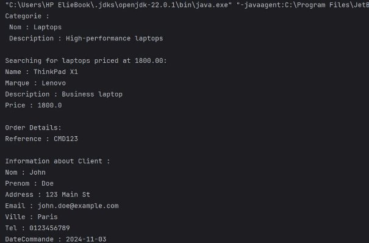

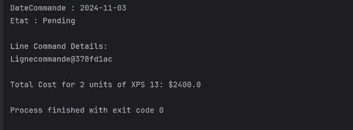

---

`Exercise 04: `

The purpose of this exercise is to manage a collection of objets of type product using the lists and the interfaces.

1.
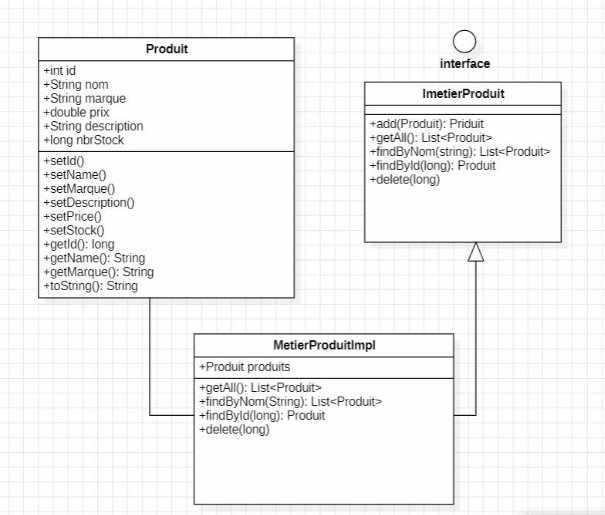

Figure 4 : Class diagram.

2. Produit Class. 
`Tasks :`
- Create the attributes, Id m Nom , Marque , Description , Prox, Stock.
- Create the methods setId , setName, setMarque , setDescription , setPrice , setStock.
- Create getId, getName , getMarque, toString.

import java.util.SimpleTimeZone;

public class Produit {

`    `private long Id;

`    `private String Nom, Marque, Description;

`    `private double prix;     ![ref3]private long stock;

`    `public void setId(long id)

`    `{

`        `this.Id = id;

`    `}

`    `public void setName(String n)

`    `{

`        `this.Nom= n;

`    `}

`    `public void setMarque(String m)

`    `{

`        `this.Marque = m;

`    `}

`    `public void setDescription(String d)     {

`        `this.Description= d;

`    `}

`    `public void setPrice(double p)

`    `{

`        `this.prix= p;

`    `}

`    `public void setStock(long l)

`    `{

`        `this.stock= l;

`    `}

`    `public long getId()     {

`        `return this.Id;     }

`    `public String getName()

`    `{

`        `return this.Nom;

`    `}

`    `public String getMarque(){         return this.Marque;

`    `}

`    `public String toString()

`    `{

`        `return "Name : " + this.Nom + "\n" +

`                `"Marque : " + this.Marque + "\n" +

`                `"Description : " + this.Description + "\n" +                 "Price : " + this.prix;

`    `}

}

3. ImetierProduit Class.
`Tasks :`
- Create an interface for managing the objects of product.
- Create the methods add , getAll , findByNom , findById , delete .

import java.util.List;

public interface  ImetierProduit {

`    `public Produit add(Produit p);

`    `public List<Produit>getAll();

`    `public List<Produit>findByNom(String motCle);     public Produit findById(long id);

`    `public void delete(long id);

}

4. MetierProduitImpl Class.
` Tasks :`
- Create this class for implementing the interface ImetierProduit and add the attribute list products.

import java.util.ArrayList;
import java.util.List;

public  class MetierProduiImpl implements ImetierProduit{     List<Produit> produits = new ArrayList<Produit>();

`    `public Produit add(Produit p)

`    `{

`        `if (!produits.contains(p))

`            `produits.add(p);

`        `else

`            `System.*out*.println("Already in the List !");         return p;

`    `}

`    `public List<Produit> getAll()

`    `{

`        `return produits;     }

`    `public List<Produit> findByNom(String motCle)     {

`        `List<Produit> list\_produits = new ArrayList<Produit>();

`        `for(Produit p : produits)

`        `{

`            `if (p.getName().equals(motCle))

`                `list\_produits.add(p);

`        `}

`        `return list\_produits;

`    `}

`    `public Produit findById(long id)     {

`        `for(Produit p : produits)

`        `{

`            `if(p.getId() == id)

`                `return p;

`        `}

`        `System.*out*.println("Not Exist this Id !");         return null;

`    `}

`    `public void delete(long id)

`    `{

`        `for(Produit p : produits)

`        `{

`            `if(p.getId() == id)

`            `{

`                `System.*out*.println("Deleted Product : " + p.getName() + "\n");

`                `produits.remove(p);

`                `break;

`            `}

`        `}

`    `}

}

5. Application Class.
`Tasks :`

- Create the application for testing the code .
- import java.util.ArrayList; 
- import java.util.List; import java.util.Scanner;

  public class Application {

  `    `public static void main(String[] ars) {

  `        `int choice = -1;

  `        `long ids = 0;

  `        `ImetierProduit interf = new MetierProduiImpl();         Scanner scn = new Scanner(System.*in*);

  `        `while (choice != 0) {

  `            `System.*out*.println("1/ Afficher La liste des produits.");

  `            `System.*out*.println("2/ Rechercher des produits par mot clé.");

  `            `System.*out*.println("3/ Ajouter un nouveau produit dans la liste.");

  `            `System.*out*.println("4/ Récuperer et afficher un produit par ID.");

  `            `System.*out*.println("5/ Supprimer un produit par id.");

  `            `System.*out*.println("6/ To quit tap random number .");

  `            `System.*out*.print("Enter a choice: ");             int choix = scn.nextInt();

  `            `scn.nextLine();

  `            `switch (choix) {

  `                `case 1:

  `                    `List<Produit> products = interf.getAll();

  `                    `if (products.toArray().length == 0 )                     {

  `                        `System.*out*.println("List empty !");

  `                    `}

  `                    `else

  `                    `{

  `                            `for (Produit p : products) { System.*out*.println(p.toString());

  `                            `System.*out*.println("\n");

  `                        `}

  `                    `}

  `                    `System.*out*.println("\n\n");                     break;

`                `case 2:

`                    `System.*out*.print("Enter a Name : ");                     String searched\_str = scn.nextLine();                     System.*out*.println("The Products searched: \n");

`                    `List<Produit> list\_pro = interf.findByNom(searched\_str);

`                    `if (list\_pro.toArray().length == 0)                     {

`                        `System.*out*.println("This is Not in list ! \n\n");

`                    `}

`                    `else {

`                        `for(Produit p : list\_pro)

`                        `{                            System.*out*.println(p.toString());

`                            `System.*out*.println("\n");

`                        `}

`                        `System.*out*.println("\n\n\n");

`                    `}

`                    `break;

`                `case 3:

`                    `Produit p = new Produit();                     p.setId(ids);

`                    `ids++;

`                    `System.*out*.print("Enter Name: ");                     p.setName(scn.nextLine());

`                    `System.*out*.print("Enter Marque: ");                     p.setMarque(scn.nextLine());

`                    `System.*out*.print("Enter Description: ");

`                    `p.setDescription(scn.nextLine());

`                    `System.*out*.print("Enter Price: ");                     p.setPrice(scn.nextDouble());

`                    `System.*out*.print("Number of Stock: ");

`                    `p.setStock(scn.nextLong());

`                    `interf.add(p);

`                    `System.*out*.println("\n\n\n");                     break;

`                `case 4:

`                    `System.*out*.print("Enter Id: ");                    long i = scn.nextLong();

`                    `if (interf.findById(i) == null)                     {

`                        `continue;

`                    `}

`                    `else

`                        `{ System.*out*.println(interf.findById(i).toString());                     }

`                    `System.*out*.println("\n\n\n");                     break;

`                `case 5:

`                    `System.*out*.print("Enter Id: ");                     long ii = scn.nextLong();

`                    `interf.delete(ii);

`                    `System.*out*.println("\n\n\n");                     break;

`                `default:

`                    `choice = 0;

`                    `System.*out*.println("Quit program");                     break;

`            `}

`        `}

`        `scn.close();     }

}
6.  Results and Cases

Case 1 : Show the list of products.

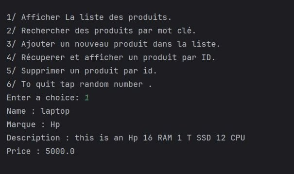

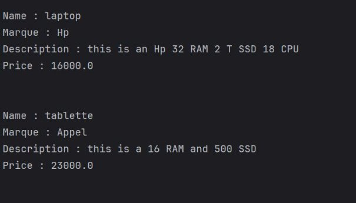

Case 2 : Search a product by name.

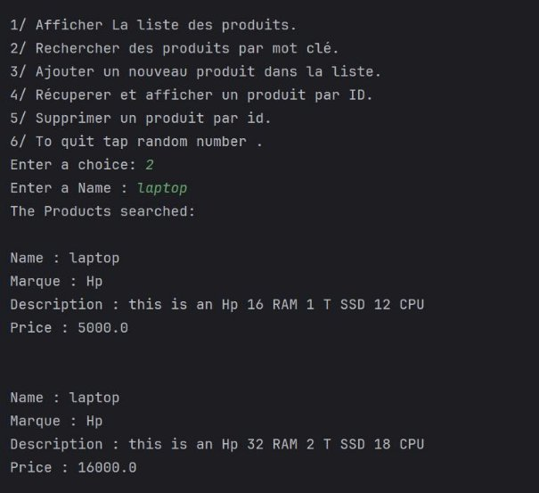

**In the case of there are no products name in the list :** 

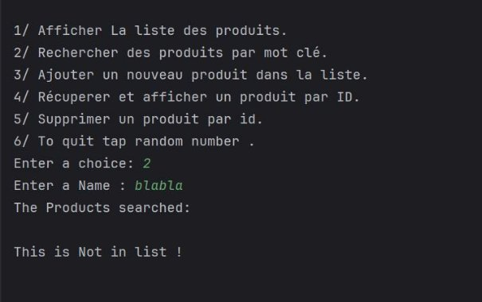

Case 3: Add new product to the list.

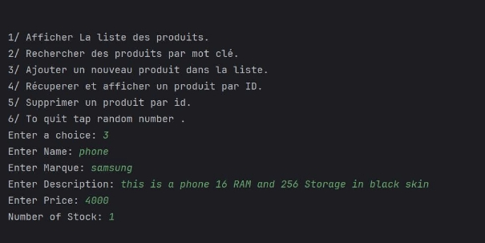

Case 4 : Get the product by ID.

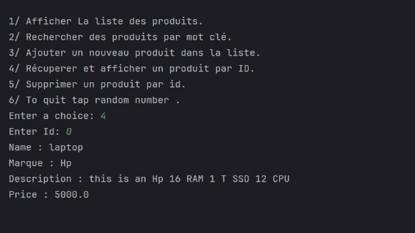

Case 5: Delete the product by ID.

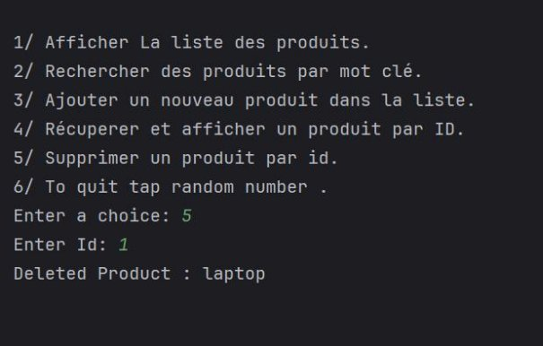

Case 6: Quit Program.

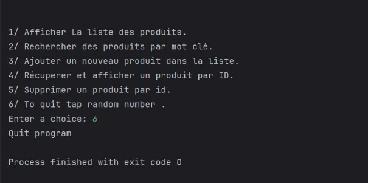

---

Summary 

In the end we saw how to use different techniques of managing the objects in JAVA, also we include the class diagrams for showing different situations.  

[ref1]: assets/Aspose.Words.3d128987-4b67-4c59-b2dc-da37ed8927d9.006.png
[ref2]: assets/Aspose.Words.3d128987-4b67-4c59-b2dc-da37ed8927d9.024.png
[ref3]: assets/Aspose.Words.3d128987-4b67-4c59-b2dc-da37ed8927d9.028.png
