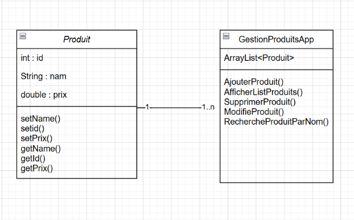
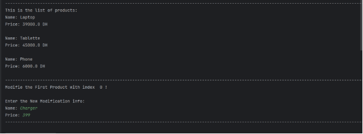
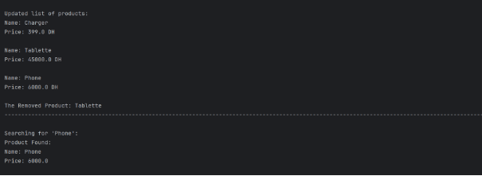
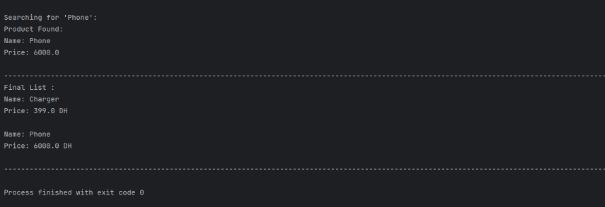
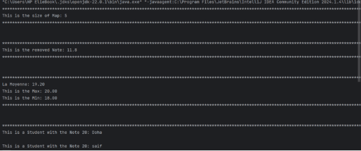
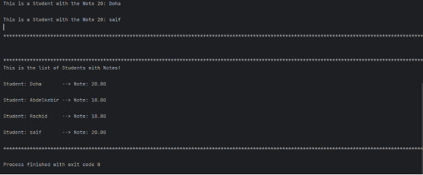
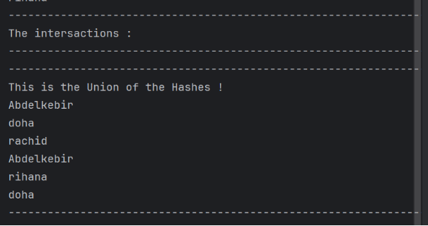
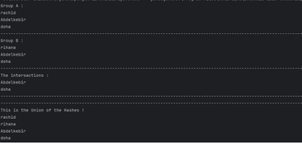

 

<h1 align="center">Practical Activity 5:</h1>

<h3 align="center">*Streams*</h3>

 

*Realized By:  Abdelkebir Bouchti* 

Content

[**Exercise 01 : Lists**](#exercice1)

1. [Class Diagram](#classdiagram1)
1. [Class Produit](#produitclass)
1. [Class GestionProduitsApp](#gestionproduitsclass)
1. [Results](#results1)
1. [Methods Implementation](#methods1)

[**Exercise 02 : Maps**](#exercice2)

1. [Hashmap Main](#main2)
1. [Results](#results2)
1. [Methods Implementation](#methods2)

[**Exercise 03 : Sets**](#exercice3)

1. [HashSet Main](#main3)
1. [Problem Faced](#problem)
1. [Solution](#solution)
1. [Results](#results3)
1. [Methods Implementation](#methods3)

[**Summary** ](#summary)

Exercise 1:

This exercise focuses on building an application JAVA for managing list of products. The goal is to implement a set of operations.

Instructions: 

[Create class Produit and Class GestionProduitsApp ].

[Create ArrayList].

[Made some operations : Ajouter, Supprimer, Afficher, Modifier, Rechercher]. 

1. Class diagram

Figure 1 – Show the class diagram of the exercise.

1. Produit Class

   Tasks: 

- Create a class Produit with the attributes correspondant.
- Create a cunstrutor for input the attributes.
- Create the default functions for set and get for access rights.

import java.util.ArrayList;
import java.util.Scanner;

public class Produit {
`    `private int id;
`    `private String name;
`    `private double prix;

`    `public Produit(int i,String n,double p)
`    `{
`        `this.id = i;
`        `this.name = n;
`        `this.prix = p;
`    `}

`    `public int getId() {
`        `return id;
`    `}

`    `public String getName() {
`        `return name;
`    `}

`    `public double getPrix() {
`        `return prix;
`    `}

`    `public void setName(String name) {
`        `this.name = name;
`    `}

`    `public void setPrix(double prix) {
`        `this.prix = prix;
`    `}

}

1. GestionProduitsApp Class

`     `Tasks:

- Create List of Products
- Create Methods : AjouterProduit, SupprimerProduit, AfficherList , Modifie Produit , RechercherProduit. 

import java.util.ArrayList;
import java.util.Scanner;

public class GestionProduit {

`    `// List to store products
`    `public ArrayList<Produit> produits = new ArrayList<>();

`    `// Method to add a product to the list
`    `public void AjouterProduit(Produit p) {
`        `if (produits.contains(p)) {
`            `System.*out*.println("This product is already in the list!");
`        `} else {
`            `produits.add(p);
`        `}
`    `}

`    `// Method to remove a product by its index
`    `public void supprimeProduit(int index) {
`        `if (index >= 0 && index < produits.size()) {
`            `Produit pro = produits.remove(index);
`            `System.*out*.println("The Removed Product: " + pro.getName());
`        `} else {
`            `System.*out*.println("Invalid index!");
`        `}
`    `}

`    `// Method to display all products in the list
`    `public void afficheProduits() {
`        `if (produits.isEmpty()) {
`            `System.*out*.println("The list is empty!");
`        `} else {
`            `for (Produit p : produits) {
`                `System.*out*.println("Name: " + p.getName() + "\n" +
`                        `"Price: " + p.getPrix() + " DH\n");
`            `}
`        `}
`    `}

`    `// Method to modify an existing product by index
`    `public void modifieProduit(int index) {
`        `if (index >= 0 && index < produits.size()) {
`            `Scanner sc = new Scanner(System.*in*);
`            `Produit p = produits.get(index);

`            `System.*out*.println("Enter the New Modification info: ");
`            `System.*out*.print("Name: ");
`            `p.setName(sc.next());
`            `System.*out*.print("Price: ");
`            `p.setPrix(sc.nextDouble());
`        `} else {
`            `System.*out*.println("Invalid index!");
`        `}
`    `}

`    `// Method to search for a product by its name
`    `public void rechercheNome(String n) {
`        `for (Produit p : produits) {
`            `if (p.getName().equals(n)) {
`                `System.*out*.println("Product Found:\n" +
`                        `"Name: " + p.getName() + "\n" +
`                        `"Price: " + p.getPrix() + "\n");
`                `return;
`            `}
`        `}
`        `System.*out*.println("Product not found.");
`    `}

`    `// Main method to demonstrate the functionality
`    `public static void main(String[] args) {
`        `GestionProduit G = new GestionProduit();

`        `// Creating sample products
`        `Produit p1 = new Produit(0, "Laptop", 39000);
`        `Produit p2 = new Produit(1, "Tablette", 45000);
`        `Produit p3 = new Produit(2, "Phone", 6000);

`        `// Adding products to the list
`        `G.AjouterProduit(p1);
`        `G.AjouterProduit(p2);
`        `G.AjouterProduit(p3);
`        `System.*out*.println("-".repeat(1000));

`        `System.*out*.println("This is the list of products:");
`        `G.afficheProduits();

`        `System.*out*.println("-".repeat(1000));

`        `// Modifying the first product
`        `System.*out*.println("Modifie the First Product with index  0 ! \n");
`        `G.modifieProduit(0);

`        `System.*out*.println("-".repeat(1000));

`        `System.*out*.println("\nUpdated list of products:");
`        `G.afficheProduits();

`        `// Removing a product by index
`        `G.supprimeProduit(1);

`        `System.*out*.println("-".repeat(1000));

`        `// Searching for a product by name
`        `System.*out*.println("\nSearching for 'Phone':");
`        `G.rechercheNome("Phone");

`        `System.*out*.println("-".repeat(1000));
`        `// Displaying final list of products
`        `System.*out*.println("Final List : ");
`        `G.afficheProduits();
`        `System.*out*.println("-".repeat(1000));

`    `}
}

1. Results:

1. Methods Implementation

Libraries : 

-> ArrayList : This is a dynamic Array for hundling the data given.

-> Scanner : It’s for read the standard output of the user.

Methods :

ArrayList<Produit> 

This is a data structure for storing the products in dynamic array, in order to manipulate the data smoothly and nicely.

.add() : This is a method of ArryaList to add an element in the array.

.remove() : The given method for retrieve an element from the array.

.contains() : This method verifie if an object is on the Array or not, the return value is True or False.

.size() : For calculate the size of the Array, return an int .

.isEmpty() : Method for testing if the list is empty or not, type of return is int.

.get(): This method is for returning an object from index given as argument.

Scanner :

` `System.in : This is an argument given to the object Scanner for knowing that we ask for input user.

Exercise 2: 

In this exercise we want to create a Hashmap for store the notes of students, although create a names as key and notes as a value, the goal here to implement operations to the Hashmap for better understanding of the Maps in JAVA. 

 2.1 Main Class

Tasks : 

- Create a HashMap for store the students by name and note.
- Insert of the notes in the HashMap
- Increase the note of a chosen student
- Delete a notes of student
- Show the size of the Map 
- Get the max and min and average Note
- Get the student who has the note equal to 20
- Show the final Map using the forEach loop
- import java.util.Collection;
  import java.util.Collections;
  import java.util.HashMap;
  import java.util.Set;

  public class Main {
  `    `public static void main(String[] args) {
  `        `HashMap<String, Double> notes = new HashMap<String, Double>();

  `        `// Inserting the notes in the hashmap
  `        `notes.put("Abdelkebir", 15.0);
  `        `notes.put("Doha", 20.0);
  `        `notes.put("Rachid", 18.8);
  `        `notes.put("saif", 20.0);
  `        `notes.put("Omar", 11.8);

  `        `//Increasing Abdelkebir's Note
  `        `notes.put("Abdelkebir", notes.get("Abdelkebir") + 3);

  `        `System.*out*.println("\*".repeat(10000));
  `        `//Show the Size of Map
  `        `System.*out*.println("This is the size of Map: " + notes.size());
  `        `System.*out*.println("\*".repeat(10000));

  `        `System.*out*.println("\n");

  `        `System.*out*.println("\*".repeat(10000));
  `        `//Remove Omar's Note
  `        `System.*out*.println("This is the removed Note: " + notes.get("Omar"));
  `        `notes.remove("Omar");
  `        `System.*out*.println("\*".repeat(10000));
  `        `System.*out*.println("\n");

  `        `//Use Collections for facilate the process
  `        `Set<String> keys = notes.keySet();
  `        `Collection<Double> values = notes.values();

  `        `//Calculate the Average, Max, Min
  `        `double median = 0;
  `        `if (!notes.isEmpty()) {
  `            `for (Double d : values) {
  `                `median += d;
  `            `}
  `        `} else {
  `            `System.*out*.println("Is empty!");
  `        `}

  `        `double maximum = Collections.*max*(values);
  `        `double minimum = Collections.*min*(values);

  `        `// Show the values of the Max, Average, Min
  `        `System.*out*.println("\*".repeat(10000));
  `        `System.*out*.printf("La Moyenne: %.2f%n", median / notes.size());
  `        `System.*out*.printf("This is the Max: %.2f%n", maximum);
  `        `System.*out*.printf("This is the Min: %.2f%n", minimum);
  `        `System.*out*.println("\*".repeat(10000));
  `        `System.*out*.println("\n");
  `        `System.*out*.println("\*".repeat(10000));
  `        `// This is the Notes of Students who has 20 Note
  `        `notes.forEach((key, value) -> {
  `            `if (value == 20.0)
  `                `System.*out*.println("This is a Student with the Note 20: " + key + "\n");
  `        `});
  `        `System.*out*.println("\*".repeat(10000));
  `        `System.*out*.println("\n");

  `        `System.*out*.println("\*".repeat(10000));
  `        `// Displaying list of students and their notes with optimized output
  `        `System.*out*.println("This is the list of Students with Notes! \n");
  `        `notes.forEach((key, value) -> {
  `            `System.*out*.printf("Student: %-10s --> Note: %.2f%n", key, value);
  `            `System.*out*.println();
  `        `});
  `        `System.*out*.println("\*".repeat(10000));
  `    `}
  }

2.2  Results

3. Methods Implementation

Libraries : 

- Collections : It’s for Manage the objects in JAVA in easy manner.
- HashMap : This is a data structure for store and retrieve the data using hash table for better implementation.
- Set : Also a data structure used for avoiding the redundance. 

Methods :

HashMap<String, Double> :To store the data in here and work with it in efficient way.

Set<String>: this is for store the keys  of the HashMap.

Collection<Double> : Also this for store the values.

.put() : This is for insert a student in the HashMap

.size() : for get the size of the HashMap

.remove() : for remove a student using the key (name)

.keySet() : Using this method we can get the keys from the data structure in above .

.values() : Using this method we can get the values from the data structure in above.

.max() : to get the max

.min() : to get the min

.forEach : is a loop using a lambda for quick process.

Exercise 03: 

In this exercise we want to discover the knowledge of the Sets in JAVA, the goal here is to create groups and implement some manipulations in order to understand the Sets.

3.1 Etudiant Class

Tasks : 

\- Create a constructor for inserting the data of students.

\- Create a getName() for better manipulation inside the code.

\- Override the equals() Method.

\- Override the hashCode Method.

import java.util.Objects;

public class Etudiant {
`    `private String Name;

`    `public Etudiant(String n)
`    `{
`        `this.Name = n;
`    `}

`    `public String getName()
`    `{
`        `return this.Name;
`    `}

`    `@Override
`    `public boolean equals(Object o) {
`        `if (this == o) return true;
`        `if (o == null || getClass() != o.getClass()) return false;
`        `Etudiant etudiant = (Etudiant) o;
`        `return Objects.*equals*(Name, etudiant.Name);
`    `}

`    `@Override
`    `public int hashCode() {
`        `return Objects.*hashCode*(Name);
`    `}
}

3.2 Main Class.

Tasks : 

- Create two groups A and B using the HashSet.
- Add names of students to each group.
- Show the intersection of the groups.
- Show the union of the HashSets. 

import java.util.HashSet;

public class Main {
`    `public static void main(String[] args) {

`        `//Inserting the Students
`        `Etudiant e1 = new Etudiant("Abdelkebir");
`        `Etudiant e2 = new Etudiant("doha");
`        `Etudiant e3 = new Etudiant("rachid");
`        `Etudiant e4 = new Etudiant("Abdelkebir");
`        `Etudiant e5 = new Etudiant("doha");
`        `Etudiant e6 = new Etudiant("rihana");

`        `//Creation of Groups
`        `HashSet<Etudiant> groupeA = new HashSet<Etudiant>();
`        `HashSet<Etudiant> groupeB = new HashSet<Etudiant>();

`        `//Adding the Students to the groups
`        `groupeA.add(e1);groupeA.add(e2);groupeA.add(e3);
`        `groupeB.add(e4);groupeB.add(e5);groupeB.add(e6);

`        `//Show the Students inside the groups
`        `System.*out*.println("Group A : ");
`        `groupeA.forEach((Etudiant e ) -> {
`            `System.*out*.println(e.getName());
`        `});

`        `System.*out*.println("-".repeat(1000));
`        `System.*out*.println("Group B : ");
`        `groupeB.forEach((Etudiant e ) -> {
`            `System.*out*.println(e.getName());
`        `});

`        `HashSet<Etudiant> intersection = new HashSet<>(groupeA);

`        `intersection.retainAll(groupeB);

`        `System.*out*.println("-".repeat(1000));
`        `System.*out*.println("The intersactions : ");
`        `intersection.forEach((Etudiant e ) -> {
`            `System.*out*.println(e.getName());
`        `});
`        `System.*out*.println("-".repeat(1000));
`        `System.*out*.println("-".repeat(1000));

`        `//Union of two Hashset
`        `groupeA.addAll(groupeB);

`        `System.*out*.println("This is the Union of the Hashes !");
`        `groupeA.forEach((Etudiant e) -> {
`            `System.*out*.println(e.getName());
`        `});
`        `System.*out*.println("-".repeat(1000));

`    `}

}

3.3 Problem Faced.

In the middle of the code where I want to test the intersection of the groups, I work with the method retainAll, but in the moment of comparing the names, by default in JAVA he compare the memory address of objects, sofor example , when we want to test intersection “Abdelkebir” groupA , “Abdelkebir “ groupeB” , even these are the same name , but the method retainAll inside of it we found , equals() , this equale compare the Object Address not the names .

And the object address are different.

In the image above of the executed code without solution look at the intersaction, even if we made the retailAll(), nothing appear. 

3.4 Solution.

! The solution here is to override the methods equal and HashCode for manipulation the objects based on the name and not memory address of the objects.

@Override
public boolean equals(Object o) {
`    `if (this == o) return true;
`    `if (o == null || getClass() != o.getClass()) return false;
`    `Etudiant etudiant = (Etudiant) o;
`    `return Objects.*equals*(Name, etudiant.Name);
}

@Override
public int hashCode() {
`    `return Objects.*hashCode*(Name);
}

3.4 Results.

3.5 Methods Implementation.

Libraries : 

HashSet : this is a library for handling a data .

Methods :

.retainAll () : This method used to test the intersection between objects.

.addAll() : This method used to made the union of two objects.

Summary

*In those exercises in the above,*

*We learn some new approaches and techniques to manipulate the data in different manner, using the Lists, Maps, Sets.*

*All of these implementations in order to get the knowledge of how to use collections in JAVA.*

