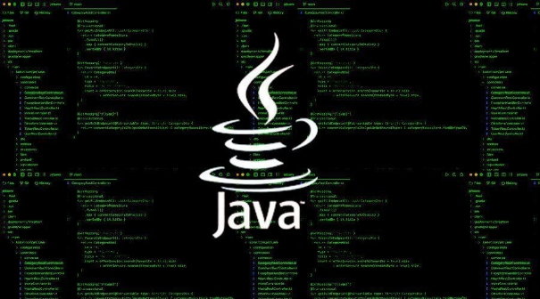
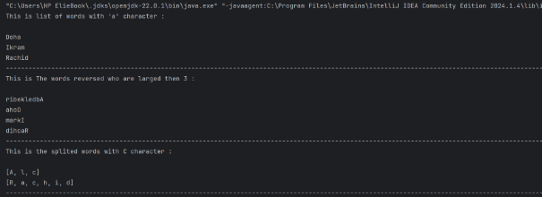
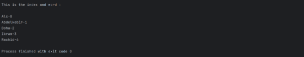
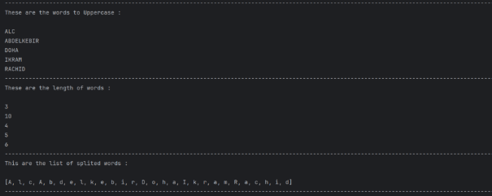
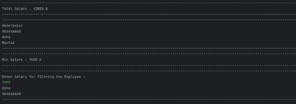
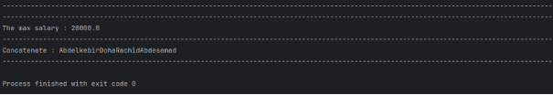

<p align="center">
 
</p>
<h1 align="center">Practical Activity 5:</h1>

<h3 align="center">*Streams*</h3>

<p align="center">
 
</p>


<p align="center">*Realized By:  Abdelkebir Bouchti* </p>


<h2 align="center">Content</h2>

<a name="_1.1_class_diagram:"></a>[**Exercise 01**](#exercice1)

1. [Main Class](#main1)
1. [Results](#result1)
1. [](#result1)[Methods Implementation](#methods1)
1. [](#methods1)[Knowledge](#knowledge)


[**Exercise 02**](#exercice2)

1. [Employe Class](#employeclas)
1. [Main Class](#main2)
1. [](#main2)[Results](#results2)
1. [](#results2)[Methods Implementation](#methods2)
1. [](#methods2)[Knowledge](#knowldege2)

[**Summary** ](#summary)

[](#summary)
**

***

<a name="exercice1"></a>|`Exercise 1:`|

                        
This exercise focuses on implementing some operations to a list of words using the methods inside the stream library :Filter , Transform , Convert.

**1.1 <a name="classdiagram1"></a><a name="main1"></a>Main Class 🔥:**
--

`Tasks`

- Filter the words by the character a.
- Filter words by length and reverse each one of them.
- Filter the words by the character e and get the words into list for each one.
- Transform the strings to Uppercase form
- Convert them to length.
- Flatten the words into one list.
- Transform to the givem form : NOM-INDEX.

```java
  import java.util.Arrays;
  import java.util.List;
  import java.util.stream.Collectors;
  import java.util.stream.IntStream;

 public class Main {  
    public static void main(String[] args) {  
        List<String> list = Arrays.asList("Alc", "Abdelkebir", "Doha", "Ikram", "Rachid");  

        System.out.println("This is list of words with 'a' character: \n");  
        // The stream here is worked by providing a certain condition.  
        list.stream()  
            .filter(name -> name.contains("a"))  
            .forEach(System.out::println);  

        System.out.println("-".repeat(1000));  

        System.out.println("This is the words reversed that are longer than 3 characters: \n");  
        list.stream()  
            .filter(name -> name.length() > 3)  
            .map(name -> new StringBuilder(name).reverse().toString())  
            .forEach(System.out::println);  

        System.out.println("-".repeat(1000));  
        System.out.println("This is the splited words with 'c' character: \n");  
        list.stream()  
            .filter(name -> name.contains("c"))  
            .map(name -> Arrays.asList(name.split("")))  
            .forEach(System.out::println);  

        System.out.println("-".repeat(1000));  
        System.out.println("These are the words to Uppercase: \n");  
        list.stream()  
            .map(String::toUpperCase)  
            .forEach(System.out::println);  

        System.out.println("-".repeat(1000));  
        System.out.println("These are the length of words: \n");  
        list.stream()  
            .map(String::length)  
            .forEach(System.out::println);  

        System.out.println("-".repeat(1000));  
        System.out.println("These are the list of split words: \n");  
        List<String> result = list.stream()  
            .flatMap(name -> Arrays.stream(name.split("")))  
            .collect(Collectors.toList());  

        System.out.println(result);  

        System.out.println("-".repeat(1000));  

        System.out.println("This is the index and word: \n");  
        IntStream.range(0, list.size())  
            .mapToObj(i -> list.get(i) + "-" + i)  
            .forEach(System.out::println);  
    }  
}
```

---
**1.2 <a name="result1"></a>Results ㊗️:**
--








---

**1.3 <a name="methods1"></a> Methods Implementation😈:**
--

`Libraries :`

Java.util.Arrays : For working with arrays.

Java.util.List : Collection of elements in a sequence.

Java.util.Stream : For work with streams and Collectors also.

**Methods :** 

.stream() : To create a stream for manipulation the data given.

.filter() : This is for filtring the data.

.map() : This is for transforming the data from datatype to another one.

.collect() : This is a collector to collect the manipulated data into a data structure like list or ArrayList.

IntStream.range(start, finish) : This is for create a list of int numbers.

.mapToObj() : Very useful method to convert the int to String.

---

**1.4 <a name="knowledge"></a>Knowledge 🧠:**
--
*For this exercise we see how to filter the data using a specific conditions, although using map to change or transfer the data with shortcuts such as (Employe::getName) or directly (e -> e.getName then use the println function to show the results), all of these are very useful.*

*** 
<a name="exercice2"></a> |`Exercise 2:`|
                         
We saw in these exercises how to manage employees and made some operations, the purpose here is to understand the ArrayList combined with streams. 

**2.1 <a name="employeclas"></a>Emoloye Class👷:**
--

`Tasks`

- Create a constructor to store the values of employe
- Create Attributes of employe
- Create getters of attributes

```java

public class Employe {

    private String Nom, Departement;
    private double salaire;

    public Employe(String n, String d, double s) {
        this.Nom = n;
        this.Departement = d;
        this.salaire = s;
    }

    public String getName() {
        return this.Nom;
    }

    public double getSalaire() {
        return salaire;
    }

    public String getDepartement() {
        return Departement;
    }
}

  ```

---

**2.2 <a name="main2"></a>Main Class 🔥:**
--
`Tasks `

- Create a list of employees using ArrayList.
- Use mapToDouble and sum for calculate the total salaries.
- Sort the employees using the sorted method.
- Find the min salary
- Filter to find the salaries larger then a given value
- Use reduce for find the employees who has the max salary
- Finally use reduce for concatenate all names in ArrayList

```java
import java.io.LineNumberInputStream;
import java.time.temporal.Temporal;
import java.util.*;
import java.util.stream.Collectors;

public class Main {
    public static void main(String[] args) {

        ArrayList<Employe> list = new ArrayList<Employe>();

        Employe e1 = new Employe("Abdelkebir","Bouchti",7000);
        Employe e2 = new Employe("Doha","Banoui",8000);
        Employe e3 = new Employe("Rachid","Hsina",7000);
        Employe e4 = new Employe("Abdesamad","zelzouli",20000);

        list.add(e1); list.add(e2); list.add(e3); list.add(e4);

        System.out.println("-".repeat(1000));
        double totalsalary = list.stream()
            .mapToDouble(e -> e.getSalaire())
            .sum();

        System.out.println("Total Salary : " + totalsalary);
        System.out.println("-".repeat(1000));

        System.out.println("-".repeat(1000));
        list.stream()
            .map(Employe::getName)
            .sorted()
            .forEach(System.out::println);
        System.out.println("-".repeat(1000));

        System.out.println("-".repeat(1000));
        double MinSalary = list.stream()
            .mapToDouble(Employe::getSalaire)
            .min()
            .orElse(0.0);
        if (MinSalary != 0)
            System.out.println("Min Salary : " + MinSalary);
        else
            System.out.println("This is an empty list ! \n");
        System.out.println("-".repeat(1000));

        System.out.println("-".repeat(1000));

        System.out.println("Enter Salary for filtering the Employees :");
        Scanner scn = new Scanner(System.in);

        double Compare = scn.nextDouble();
        ArrayList<Employe> new_list =
            list.stream()
                .filter(e -> e.getSalaire() > Compare)
                .collect(Collectors.toCollection(ArrayList::new));

        if(!new_list.isEmpty()) {
            for (Employe e : new_list) {
                System.out.println(e.getName());
            }
        } else {
            System.out.println("No one has greater than this value: " + Compare);
        }

        scn.close();
        System.out.println("-".repeat(1000));
        System.out.println("-".repeat(1000));

        // Here converting employee object to its salary
        double maxSalary =
            list.stream()
                .map(Employe::getSalaire)
                .reduce(Double.MIN_VALUE, (e, ee) -> e > ee ? e : ee);

        if (maxSalary != 0)
            System.out.println("The max salary : " + maxSalary);
        else
            System.out.println("This is an empty list!");

        System.out.println("-".repeat(1000));

        String concatenateNames = list.stream()
            .map(Employe::getName)
            .reduce("", (n1, n2) -> n1 + n2);

        System.out.println("Concatenate : " + concatenateNames);
        System.out.println("-".repeat(1000));

    }
}

```
---

**2.3 <a name="results2"></a>Results 💥:**
--




---

**2.4 <a name="methods2"></a>Methods Implementation 👿:**
--
The same methods and libraries of the first exercises I get to mention the new methods !

.reduce() : this is for searching and compare values like the salaries.

.min() : to get the min value from the map research.

.sorted() : to sort the list based on the names

.orElse() : We made this for the Case if the user enter nothing, the program return 0.

.sum() : To some the salaries of employees

---

**2.5 <a name="knowldege2"></a>Knowledge 🧠:**
--
*In this exercise we get the knowledge of how to use the methods mentions in exercise for implementing the the need of exercise,*

*We saw how we can control and play with the methods inside the streams library.*

*Also we know that the streams are lazy use piplines, they can handle the data without storing the results, this is useful when we work with large data.*


\*
***
**<a name="summary"></a>Summary ♾️:**
--
*In the end we can say the streams are an amazing way to process collections and take control over them in easy way, streams allow developers to perform complex data manipulations in smart manner.*


