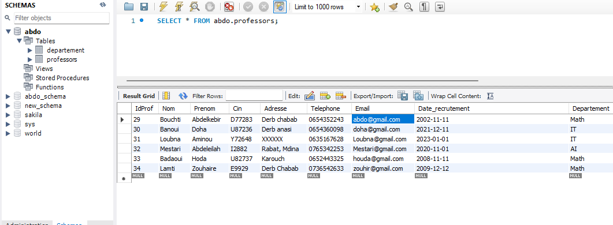
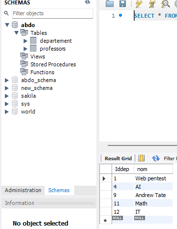

# TP 6
---

### MCD
---


### MLD

## Modèle Logique de Données (MLD)

### Table: Professeur
| **Nom de Colonne**    | **Type**    | **Contraintes**                                  |
|------------------------|-------------|-------------------------------------------------|
| `id_prof`             | `INT`       | PRIMARY KEY                                     |
| `nom`                 | `VARCHAR`   | NOT NULL                                        |
| `prenom`              | `VARCHAR`   | NOT NULL                                        |
| `cin`                 | `VARCHAR`   | NOT NULL, UNIQUE                                |
| `adresse`             | `VARCHAR`   |                                                 |
| `telephone`           | `VARCHAR`   |                                                 |
| `email`               | `VARCHAR`   | NOT NULL, UNIQUE                                |
| `date_recrutement`    | `DATE`      |                                                 |
| `id_depart`           | `INT`       | FOREIGN KEY REFERENCES `Departement(id_depart)` |

---

### Table: Departement
| **Nom de Colonne**    | **Type**    | **Contraintes**                                  |
|------------------------|-------------|-------------------------------------------------|
| `id_depart`           | `INT`       | PRIMARY KEY                                     |
| `nom`                 | `VARCHAR`   | NOT NULL                                        |

---

### Relations ☺️:
- **1:N Relation**:
  - Une instance de `Departement` peut être associée à plusieurs instances de `Professeur`.
  - Implémentée via la clé étrangère `id_depart` dans la table `Professeur` qui fait référence à `id_depart` dans la table `Departement`.


***

### Goal 🥅:
---
In this Practical activity we want to make an application for manipulate some professors and departments using javaFX,
First of all, the application must be runned by javaFX and scene Builder , finally Mysql for handling the data !

### Functionalities ▶️:
---

As we see in the MLD and MCD, the application must include features like addProfessor addDepartment and the other requested functionalities.

**Professor requirement 👨‍🏫:**
```bash
-> addProfessor
-> deleteProfessor
-> updateProfessor
-> affectDeptoProfessor
-> searchProfessor
-> showProfessors
```

**Departement requirement 🏬:**
```bash
-> addDepartment
-> deleteDepartement
-> affectDepartement
-> updateDepartement
-> ShowprofessorbyDepartment
```

***

## Databases Screens 🖼️:
---
After some time I create a basic database for an example to show how the things work first, as well to stick to the requirements of the Practical Work !

*This is the pictures or the screens of the DB locally.*

### Professors Data👨‍🏫:
--



### Department Date🏬:
--



***
# Code ☣️:
---

*For avoiding the overwealming the codes are in a directories and also the FXMLs and all required stuff.*

***

# Screens of Real scenario.
---
**After click on run, we see this screen shows up, it's the main screen of the project, where we have two choices, 
go to professor operations or department operations.**


**After the decision of choosing the professors operations the program go from FXML of the main interface into the FXML of professors,
as we can see in the figure, it shows a tableview with pre-defined database (it s the basic example I can give for better understanding !) with the columns and the names etc ... .
Also we see some buttons for the configuration and do some changements.
I will resume the work in this sentence : I will test them all !**

---
## Professors

### AddProfessor.
When we click on addProfessor button this dialog appear and you must insert some information, i will share figure and we pass to the next button.


### UpdateProfessor.
This button depend on the selector professor, in better explanation, if you want to update some professor just click on it and then click on the button and enter the updates that you love.


### DeleteProfessor.
The delete button also use the feature of selector, when you select a professor and click on delete, it's deleted immediately.

*As we see I delete hoda from the table !*


### SearchForprofessor.
After click on the button, a dialog shows up with a input name for intering the search target.


### AffectDepartment
For this functionality, I made my thinking to affect departments after seeing the departments available and assigning by Id, I don't use names cause it's easy.


### Update.
The last button it's just for update tableview (It's automatically , but in the case where you see something fixed you can click on it).


---
## Departements

In the first place, we see this table view by default show all departements those are available.


### adddepartements
As we can see after clicking on the button add he shows this dialog to enter some department.


### Updatedepartement
In this case also we depend on the selector feature to change the name, This is the figure that shows after click on the button.


### Deletedepartement
This is also depending on the selector to delete a department, we see on the figure Math departement are deleted : 


### ShowProfessors
This is the last button where we want to see professors for a specific department, in the scenario we click on IT and then click on showprofessors and we got those professors : 


***


