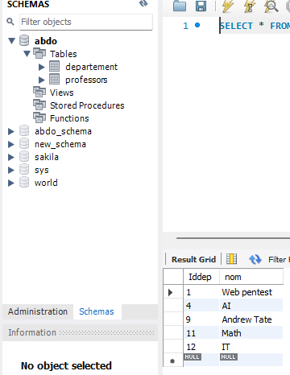

# TP 6
---

### MCD
---

### MLD

## Modèle Logique de Données (MLD)

### Table: Professeur
| **Nom de Colonne**    | **Type**    | **Contraintes**                                  |
|------------------------|-------------|-------------------------------------------------|
| `id_prof`             | `INT`       | PRIMARY KEY                                     |
| `nom`                 | `VARCHAR`   | NOT NULL                                        |
| `prenom`              | `VARCHAR`   | NOT NULL                                        |
| `cin`                 | `VARCHAR`   | NOT NULL, UNIQUE                                |
| `adresse`             | `VARCHAR`   |                                                 |
| `telephone`           | `VARCHAR`   |                                                 |
| `email`               | `VARCHAR`   | NOT NULL, UNIQUE                                |
| `date_recrutement`    | `DATE`      |                                                 |
| `id_depart`           | `INT`       | FOREIGN KEY REFERENCES `Departement(id_depart)` |

---

### Table: Departement
| **Nom de Colonne**    | **Type**    | **Contraintes**                                  |
|------------------------|-------------|-------------------------------------------------|
| `id_depart`           | `INT`       | PRIMARY KEY                                     |
| `nom`                 | `VARCHAR`   | NOT NULL                                        |

---

### Relations
- **1:N Relation**:
  - Une instance de `Departement` peut être associée à plusieurs instances de `Professeur`.
  - Implémentée via la clé étrangère `id_depart` dans la table `Professeur` qui fait référence à `id_depart` dans la table `Departement`.

